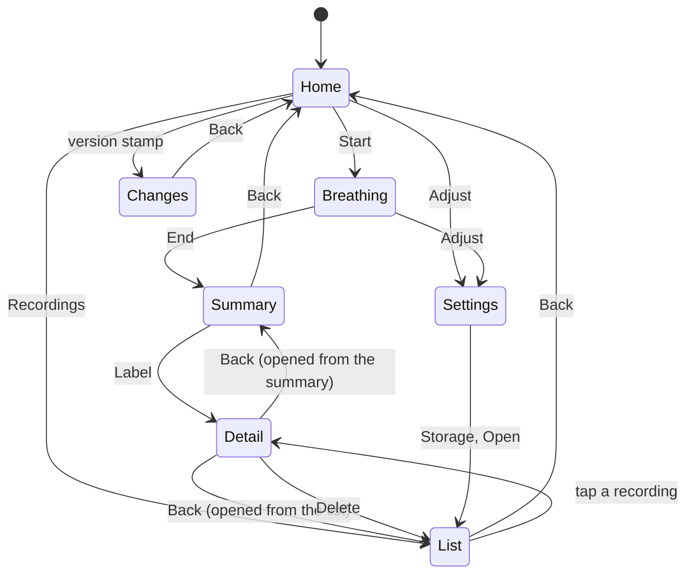

# CLAUDE.md

Operating notes for coding agents working on **breathe**. Read this before editing anything.
Design rationale and evidence live in `README.md`; this file is the contract.

---

## 1. What this is

A single-page web app that reads iPhone motion sensors while the phone lies on the user's
belly, extracts the breathing waveform from the gravity vector, and drives an ambient
Web Audio instrument from it. The sound gets warmer as breathing slows. There is no pacer,
no guide tone and no target rate — see §3.

Repository layout:

```
index.html              markup only
app.css                 every style, and the only place a colour is written down
manifest.webmanifest    name, colours and icon for an installed copy
icon.png                512px, generated by the commit that added it
sw.js                   service worker: offline, and the update flow
src/util.js             0. helpers, the shared palette, the canvas fitter
src/audio.js            1. the audio engine
src/breath.js           2. the breath tracker
src/pulse.js            3. experimental heart rate
src/store.js            4. Recorder and Store (IndexedDB)
src/review.js           5. summary, session browser, labelling
src/main.js             6. releases, lifecycle, render loop, drawing, wiring
README.md               reasoning, decisions, evidence, limitations
CLAUDE.md               this file
tools/dsp-harness.mjs   headless Node test for the signal chain
tools/smoke.mjs         runs the whole app in Node against stub DOM/audio/IndexedDB
tools/stub/             the DOM, Web Audio and IndexedDB those tests run against
tools/replay.mjs        replays an exported session through the real tracker
tools/analyze.mjs       describes a recorded session: timing, depth, stillness
tools/onset.mjs         measures how early the sound starts, against the raw tilt
```

---

## 2. Hard constraints

These are not preferences. Breaking one breaks the product.

| Constraint | Why |
|---|---|
| Zero dependencies and no build step. Static files only | This was "one file" until the owner lifted it explicitly, so that it could be modularised. What did not change: what GitHub Pages serves is exactly what is in the repository. Do not add npm, a bundler, TypeScript compilation, a CSS preprocessor, or a CDN import. The cost of the split is that `file://` no longer works — ES modules are blocked by CORS there — so the app must be served over http(s). That is already true of `devicemotion`, which needs a secure context. |
| Anything the app is made of goes in `sw.js`'s `SHELL`, and `VERSION` there matches `RELEASES[0].v` | There is no build step to generate either. A file missing from the precache list is a file that vanishes offline; a stale `VERSION` means the update never installs. `tools/smoke.mjs` asserts both — if you add a module, that check fails until you list it. |
| IndexedDB is the **only** permitted store. No `localStorage`, `sessionStorage` or cookies | The ban on all persistence held until the owner lifted it explicitly, to collect real breathing data for algorithm work. A twenty-minute session is ~2.8 MB exported, far past localStorage's ~5 MB ceiling for even two recordings, so IndexedDB is a capacity requirement rather than a preference. `Store.available` must go false and every method resolve harmlessly when IndexedDB is blocked — a recording failure must never disturb a breathing session. |
| Recordings never leave the device | Storage changed; the privacy claim did not. No upload, no sync, no analytics. Export is `Blob` → `URL.createObjectURL` → `<a download>`, and only the user starts it. |
| No network call to any origin but this app's own | The privacy claim in the UI ("Motion never leaves the phone") must stay literally true. No fonts, no analytics, no error reporting, no CDN. The service worker fetches this app's own files and nothing else; it is the only thing in the codebase that calls `fetch()`, and it must stay that way. |
| `DeviceMotionEvent.requestPermission()` is called synchronously inside the Begin tap handler, **with no `await` anywhere before it** | It requires transient activation and a secure context; without activation it rejects with `NotAllowedError` (https://developer.mozilla.org/en-US/docs/Web/API/DeviceMotionEvent/requestPermission_static). WebKit is cruder than the spec — activation in practice only holds inside the same stack as the click handler, so one `await` before the call is enough to lose it (https://macwright.com/2022/07/11/activation). This shipped broken once: `await Audio.start()` sat above the call. See §9. |
| `AudioContext` is created in the same tap | iOS starts it suspended otherwise and the session runs silently. `Audio.start()` is async but constructs the context before its first `await`, so calling it without awaiting is correct and deliberate. |
| Every failure path produces a specific notice | A sensor failure that falls through silently reads to the user as "the app is broken". `requestSensor()` returns `ok` / `denied` / `unsupported` / `error:<Name>`; `begin()` must handle all four. |
| No medical claims in UI copy | It says "A relaxation tool, not a medical device." Keep it that way. Feature copy may describe what the sound does, never what the body will do. |
| System fonts only | No webfont fetch. The stacks in `:root` degrade sanely on Android and desktop. |

---

## 3. Map of the modules

The section numbers survived the split into files, because the numbering is how every
comment in the codebase refers to them.

| Module | Contents |
|---|---|
| `src/util.js` | `$`, `clamp`, `lerp`, `TAU`, `lp()` one-pole filter, `fin()` finite guard, `notice()` toast, `fitCanvas()`, `palette()`/`alpha()` |
| `src/audio.js` | `Audio` — one voice (shore), procedural noise and impulse response, mid/side width, per-frame parameter updates |
| `src/breath.js` | `Breath` — filtering, continuous axis tracking, projection, AGC, cycle detection, rest, confidence, phase |
| `src/pulse.js` | `Pulse` — experimental heart rate from the same accelerometer |
| `src/store.js` | `Recorder` (typed-array capture) and `Store` (IndexedDB: recordings, settings, eviction, export) |
| `src/review.js` | `Review` — the summary End lands on, the session browser, labelling |
| `src/main.js` | `RELEASES`/`Updater`/`Log`, `UI`/`el`, the control table, permissions, wake lock, session lifecycle, rAF loop, canvas drawing, event wiring |

The dependency graph is a DAG and should stay one. Everything imports `util`; `review`
imports `store`; `main` imports the rest. **Nothing imports `main`** — that is what keeps
the tracker loadable in Node without a DOM, which is what every tool in `tools/` relies
on. If a helper in `main` is wanted somewhere else, move it to `util`, as `fitCanvas` was.

`audio`, `breath`, `pulse`, `store` and `review` **must be inert at import time**: no
`document.getElementById`, no `indexedDB`, no `new AudioContext`, only inside methods.
`main` is the exception — it wires the DOM as it loads, which is safe because
`<script type="module">` is deferred.

Colours live in `app.css` and nowhere else. Canvas cannot use `var()`, so `palette()`
reads the tokens once off `:root` and `alpha()` turns one into `rgba()`; a hex literal
in a `.js` file is a bug, and a hex literal in a CSS *rule* (as opposed to a `:root`
definition) is one too.

There is no spoken guidance, no session length, and no calibration step. Start asks for
motion access and the session begins; End stops it and lands on the summary. Do not add a
setup phase, a countdown, or a voice — the app sonifies breathing and gets out of the way.

There is no pacer. The app once led the user from their measured rate toward a target
and rewarded them for staying phase-locked to a guide tone; that was removed because it
competes for attention with the breathing itself. Nothing should reintroduce a target
rate, a guide tone, or a sync reward.

**Experiments live under "Try" and default to off.** `Flags` in `src/main.js` holds them;
they are ordinary rows in `TOGGLES`, so they save and restore like everything else. The
heading says out loud that they are not sure of themselves. This is where to put something
worth trying that is not worth defaulting on — it is not a place to park a half-finished
feature, and a flag that has earned its keep should graduate out of the section rather
than live there forever.

**`src/main.js` exports `UI`, `Flags` and `Dim`, for `tools/smoke.mjs` only.** The test
drives the app the way a finger does and needs to see state a finger cannot — a timer that
is armed, a flag that is set. Nothing in `src/` may import them; see §3.

**Demo mode is not a sine wave.** It is the shape the owner described from their own
trace — a long flat bottom, a quick rise, a pause at the top, a slower fall — at 6/min,
with smootherstep on the two strokes so the turnarounds have no corner for the τ = 0.35 s
filter to ring on. It was a sinusoid, which is exactly the case the tracker finds easy and
which hid both of the timing bugs this app has shipped. Do not put the sine back: demo mode
is how the sound gets auditioned, and it should audition against something breathable.

**Every control in Adjust belongs in `SLIDERS` or `TOGGLES` in `src/main.js`.** Each row
of those tables says what the control drives, what its default is, and what key it saves
under; the wiring, the restore, the save and the reset are all generated from them. A
control wired by hand gets three of the four and looks fine until someone reloads. Demo
mode is the one deliberate exception and says why in a comment.

---

## 4. Signal-chain invariants

The numbers below were chosen against the physics, not tuned by ear. Changing one without
re-running the harness is how this regresses.

**Band.** Breathing at 5–20 breaths/min is 0.08–0.33 Hz. The chain isolates roughly
0.013–0.45 Hz:

```
raw (accelerationIncludingGravity, m/s²)
  → smooth   = lp(raw,    τ = 0.35 s)   # kills pulse, tremor, sensor noise
  → baseline = lp(smooth, τ = 3 × period, 12–60 s)   # tracks posture and settling
  → d = smooth − baseline               # the band-passed gravity deviation
  → s = d · u                           # u = breath axis from calibration
```

- **Use `accelerationIncludingGravity`, not `acceleration`.** Belly motion is quasi-static
  tilt; the gravity-removed vector is near zero at these frequencies. `acceleration` is only
  a fallback when the gravity variant is absent. Both are m/s² on three axes:
  https://developer.mozilla.org/en-US/docs/Web/API/DeviceMotionEvent
- **The baseline spans three breaths, not twelve seconds.** It is a high-pass, and a
  high-pass turns a hold into a ramp: across a 10 s hold a τ = 12 s baseline has already
  climbed 57 % of the way back to the signal, so the app hears an inhale starting while
  the belly is flat. A recorded session at 3 breaths/min holds the bottom for 5–10 s, and
  against the raw tilt the sound was swelling a median 1.9 s early and up to 9.8 s early.
  `τ = clamp(3 × period, 12, 60)`. The floor is the old value, so nothing moves for
  ordinary rates; the ceiling keeps a standing postural offset (τ × drift rate) smaller
  than a breath. Do not put it back to a constant — the constant is what breaks slow
  breathing, and slow breathing is the point of the app.
- **All filters take measured `dt`.** `devicemotion` fires at a regular but
  device-dependent interval (https://developer.mozilla.org/en-US/docs/Web/API/Window/devicemotion_event);
  iOS is around 60 Hz. Never hardcode a sample rate — the passband must not move if the
  rate does. `dt` is clamped to 0.5 s and falls back to 1/60 on a stall.

**Axis tracking.** There is no calibration. `trackAxis()` keeps a covariance of `d` with
exponential forgetting (τ = 25 s) and re-solves the dominant eigenvector every 0.4 s by
power iteration **warm-started from the axis already in use** — so it costs a handful of
rounds and cannot jump between refreshes. Early on the forgetting factor is `max(1/n, …)`,
which averages everything seen so far and converges in seconds rather than time constants.

**The covariance is taken about the mean.** Postural drift leaves a standing offset in `d`
— 0.6 m/s² per minute puts 0.12 through the 12 s high-pass, larger than a breath — and a
covariance about zero locks the axis onto that offset. The drift check went from 0.00/min
to 6.00/min when this was fixed.

`√λ₁` is `axisAmp`, the size of a breath in m/s². It is the only physical quantity in the
chain and the one that tells a belly from a table.

**Sign** is resolved once, by `resolveSign()`, when confidence first passes 0.5, and then
left alone — a sign that changes mid-session is indistinguishable from the user turning
over. It re-arms only after 45 s of lost tracking. The *Flip direction* toggle remains the
user-facing escape hatch. Sign is resolved by counting rising vs
falling sample transitions and flipping when `up > down * 1.12`, on the assumption that
relaxed breathing exhales more slowly than it inhales. The *Flip direction* toggle is the
user-facing escape hatch — keep it.

**AGC.** `rms = lp(s², τ = 14 s)`, `scale = max(√rms · 1.55, 0.006)`, output clamped to
±1.8. The 0.006 floor stops the gain running away when the phone is on a table. If you
raise the τ, the app takes longer to adapt after the user shifts position.

**Known bias.** The τ = 0.35 s smoothing filter delays sharp transitions more than gentle
ones, so on asymmetric breathing the reported inhale runs ~0.4 s long and the exhale ~0.4 s
short at a 7 s cycle. The total is unaffected. The harness asserts these bounds explicitly
rather than the true values — if those checks start failing, the smoothing τ has moved.

`finishCalibration()` also records `Breath.flipped` — whether the sign heuristic
fired — purely so an exported session can say so. It changes no behaviour.
`Breath.vel()` returns the *signed* velocity, −1..1, positive while inhaling. The
audio engine needs direction; `speed()` only ever carried magnitude.

**Cycle detection.** Peak/trough with hysteresis scaled to the depth the user actually
breathes at: `H = clamp(strokeAmp · 0.30, 0.30, 0.80)`, where `strokeAmp` is an EMA
(α = 0.25) of measured peak-to-trough excursions, seeded at 1.7. Periods outside 3–36 s
are discarded — see §4a for the fast end and §4b for the slow one. Period EMA α = 0.45, bpm EMA α = 0.4. Lowering the coefficient makes it
double-count on noisy signals; raising it drops shallow breaths.

`H` was a fixed 0.34 until the first real recording measured a median stroke of 1.75
normalised units — so the threshold sat at 19 % of a breath, and 56 of 57 exhale bottoms
cleared it more than 0.6 s before the signal reached half a stroke. At `H = 0.61` on that
same recording the count falls to 23 of 57 with the *identical* 57 peaks and troughs and
the same 11.28 s median period, so the sensitivity costs nothing in rate tracking.

**Rest.** Slow breathing has real holds in it. `detectRest()` compares `|ṡ|` against this
user's own **peak** stroke velocity, followed directly: `slopePeak` attacks at τ = 0.5 s and
releases at τ = 30 s, so a stroke sets it within half a second and it holds across a long
pause. It enters "still" under a ratio of 0.22 and leaves it over 0.50 — a dead band, so a
wobble on the threshold cannot chatter.

That peak used to be *inferred* from the mean as `mean · 1.57`, which is the ratio for a
sinusoid and only for a sinusoid. A 3 s inhale inside a 20 s cycle sits several times
further above its mean, so the inferred peak came out far too low, every hold measured as
movement against it, and the gate stayed open through exactly what it exists to catch —
12 % of a hold-heavy session read as rest where 43 % does now. **Do not re-derive the peak
from the mean.** The thresholds are unchanged because they were always expressed against a
peak; only the estimate of it moved. `resting` needs 0.5 s of holding, and `restGate` fades in over
0.30 s and out over 0.60 s. **`vel()` and `speed()` are both multiplied by `restGate`.**
This exists because velocity is normalised against breathing rate in `Audio.frame()`: at
5.4 /min the reference peak is 0.216, so a belly tremor of 0.05 divides out to a
quarter-strength inhale. Comparing against the rate alone cannot tell a hold from a stroke;
comparing against the user's own strokes can.

**Phase.** `phase = atan2(−ṡ_lp / ω, s)` with `ω` clamped to 0.25–2.2 rad/s and
`ṡ` low-passed at τ = 0.28 s.

```
phase = 0        top of the inhale
phase ∈ (0, π)   exhaling
phase = ±π       bottom of the exhale
phase ∈ (−π, 0)  inhaling
```

Nothing else depends on this convention now that the pacer is gone, but every recorded
session carries a `phase` channel that uses it, so replay and analysis still read it.

---

## 4a. Is it breathing at all?

The app used to sonify whatever the accelerometer produced. `recordings/breathe-*-bogus.json`
is a phone left on a table and then waved by hand, and the app reported **248 breaths at
26/min** from it. Two numbers now come out of `scoreConfidence()`, because the two questions
have different deadlines:

| | what it asks | how fast | what it drives |
|---|---|---|---|
| `follow` | is there movement of a plausible size? | seconds | the sound |
| `conf` | is it rhythmic enough to call a rate? | a few cycles | rate readout, breath count, recorded `bpm` |

Three terms, each set against measurement rather than taste:

- **size** — `axisAmp` between a floor and a ceiling. Real sessions measured 0.32 and
  0.45 m/s²; a phone on a table 0.007; being waved 6.4. Both bounds matter — a belly does
  not move the gravity vector by six.
- **rhythm** — how alike consecutive periods are. Real sessions 1.09–1.29×, the bogus
  recording 1.66–6.03×. **Capped at 0.30 until three periods exist**, so "no evidence yet"
  cannot read as "confident". That cap is what keeps the gap structural: a rate is reported
  above 0.45, and confidence without rhythm evidence cannot reach it.
- **calm** — `motionRms`, which rejects a phone being carried.

The plausible period band is **3–36 s**. The fast end was 2 s, which admitted the bogus
recording's 1.2 s "breaths"; nobody using this app breathes faster than 20/min. For the
slow end see §4b.

**Sensitivity** (a user control, 0–1) moves both the size floor and the rhythm tolerance.
Where the line falls between a shallow breather and a still phone depends on the body and
where the phone sits, and is not something two recordings can settle.

**Do not re-tune these against the recordings in `recordings/`.** Two sessions is not a
sample; the sensitivity control exists so the user can settle it on their own body.

## 4b. The slow end

The owner breathes at a median **2.9 breaths a minute**, with a period distribution of
p25 17.8 s, median 20.4 s, p75 24.3 s and a longest of 30.1 s. Two constants were set for
someone breathing three or four times faster than that, and both were measured against
that recording rather than guessed:

- **The detector's period ceiling was 30 s**, so the longest breath in that session was
  discarded outright, and 6 of its 28 periods sat within 20% of being discarded. It is
  **36 s** now, which is 1.7 breaths a minute. The fast end did not move: that one is
  load-bearing against the bogus recording and §4a explains why.
- **`Audio.frame()` clamped `bpm` to a floor of 4/min** before computing the velocity
  reference. At a real 2.9/min that made the reference **32% too large for the whole
  session**, so every velocity-fed layer — the swell's inhale gain and resonance, the
  foam, the spray — ran about a quarter under-scaled. The floor is 2/min now, and the
  reference is `velRef(bpm)`, exported so the smoke test can check it directly rather
  than inferring it from a filter somewhere.

`omega` is clamped to **0.16**–2.2 rad/s rather than 0.25, because 0.25 rad/s is a 25 s
breath and the recorded `phase` channel was being bent for anything slower.

The DSP harness tracks 12, 6, 3 and ~2/min. The 2/min case deliberately alternates 27 s
and 32 s breaths, because real slow breathing is not metronomic and a clean 30.0 s
sinusoid slips under a 30 s ceiling: with the old ceiling that check reports 2.18/min from
3 of 6 periods instead of 2.02 from 6 of 6.

**Do not re-tighten either constant to "reject noise".** Neither one is what rejects the
bogus recording — size, rhythm and stillness are, and they are unchanged.

## 4a2. Pulse (experimental)

Ballistocardiography from the same accelerometer. It is **off by default** and must stay
that way: on a belly the beat is one to ten milli-g against a breathing tilt of 90, and it
finds nothing far more often than it finds something.

- Band-pass 4–14 Hz, **two poles on the high-pass**. One pole leaves breathing only 27 dB
  down, and rectifying that leak produced an envelope with no beat in it at all — the
  autocorrelation was a clean monotonic slope from the breathing and nothing else.
- The envelope is de-trended (`τ = 0.35 s`) before buffering, because rectification folds
  slow modulation straight back in.
- **Take the best *local* maximum of the autocorrelation, never the global one.** The
  envelope is smoothed at 60 ms, so neighbouring samples correlate strongly and the curve
  decays monotonically from zero lag; the global maximum is always the shortest lag tried,
  whatever the real rate.
- **Prefer the shortest lag within 80 % of the strongest.** Every beat also peaks at twice
  its period. Without this the estimate alternates between a rate and half of it, and any
  smoothing then parks on an average the heart never had — 96/min was reported as 48.
- A jump over 20 % replaces the estimate rather than blending into it, for the same reason.
- **`MAX_MOTION` is 0.25 m/s², and it must stay above the noise floor of a still body.**
  It was 0.05, which is *below* it: 9.5 minutes of someone lying quietly with the phone on
  the belly measures 0.084 median and 0.117 at the 95th percentile, so `reading()` returned
  0 for the whole of every session and the readout could never show anything at all. 0.25
  clears a still body twice over and sits five times under a phone being carried (1.28 on
  the bogus recording). Any tightening of this number needs a still-body measurement first.
- `reading()` returns 0 whenever confidence is under `MIN_CONF` or `Breath.motionRms`
  exceeds `MAX_MOTION`, and the UI shows a dash. **Never hold the last number on screen
  after the evidence has gone** — that makes it look far more reliable than it is.
- No medical claims. It is labelled experimental in the settings and says so plainly.

Measured on synthetic data: correct within 4/min across 42–135 bpm (39 of 39 runs), zero
false positives on noise over 10 runs, and a lock threshold around 2 milli-g of beat
amplitude. On the one real belly recording that carries motion rows it holds 73–83 /min
across 9.5 minutes (p50 78.5) at confidence 0.46–0.98, reporting on 55 of 55 samples, while
the bogus recording gives 4 scattered readings out of 14. That is plausible and remarkably
steady, but **steady is not correct: it has still never been checked against a real
heartbeat.** Say so wherever the number is discussed.

## 5. Audio invariants

- **`Audio.frame(f)` takes an object, and it carries direction.** `tools/smoke.mjs` holds
  this as a check rather than a hope: it drives `frame()` at the same belly position and
  the same speed in both directions and asserts that the parameters differ. With `vel`
  replaced by `|vel|` that check reports 0 parameters differing, which is what the bug
  below actually looked like. The old positional
  `frame(level, speed, rich, …)` passed only the *magnitude* of belly movement,
  so inhaling and exhaling at the same belly position produced identical parameters —
  no amount of mix tuning could make the two halves distinguishable. `f` now carries
  `{level, vel, speed, inhaling, resting, rich, bpm, dt}`, where `vel` is signed and
  positive while inhaling. There is no `pacerLvl` or `pacerVel` — the guide tone and its
  two oscillators are gone from the graph. **If a voice ever sounds directionless, check
  that `vel` is actually being passed before touching the voice.**
- **Velocity is normalised against the current rate.** Peak `|vel|` scales with
  breathing rate: at 6/min it is ~43 % of its 14/min value, because `ds/dt` peaks at
  `ω = 2π·bpm/60`. Dividing by a fixed constant made every velocity-fed layer quieter
  exactly as the user slowed down — the app rewarded slowness with `rich` while fading
  out its most breath-like layer. `frame()` divides by the peak the current rate
  implies. Do not replace that with a constant.
- **One voice, seven controls.** Shore is the only sound; Tide and Harmonium were deleted
  rather than kept as also-rans. `Audio.mix` carries swell, brk, foam, spray, under
  (0–1.5, so a layer can be pushed past its designed level), and bright/space (0–1).
  `setMix(key, v)` is safe at any time. Brightness moves every filter corner together over
  ±1.55 octaves, **except the undertow, which follows at `br^0.35`** — taking the bottom
  out along with everything else makes the sound thinner rather than darker.
- **There is no pitched layer.** A 55/110 Hz sub and a pair of upper tones sat under the
  water behind a `tone` control; the owner called them annoying and asked what they were
  for, which is the right question — they read as a drone laid over the sea rather than as
  part of it. Deleted, control and all. Do not reintroduce a pitch centre "for warmth";
  `rich` is the warmth channel.
- **Space is width first, reverb second.** A send alone was inaudible, and correctly so:
  the voice is entirely noise, and convolved noise still sounds like noise because there is
  no transient for a room to smear. Space now drives a mid/side width gain (0.35 narrow,
  1.9 wide) on the whole voice as well as the send. If the width network is ever removed,
  the control goes back to doing nothing you can hear.
- **The break announces itself when its slider moves.** It only ever sounds at the top of a
  breath, so a user adjusting it while sitting up holding the phone heard no difference
  between 0 and 150 — the event was simply never firing. Moving `#mBreak` previews the
  crest, debounced at 900 ms. Any control whose sound is an event rather than a level needs
  the same treatment.
- **Everything is a `setTargetAtTime` on a smoothed parameter.** Never set an
  `AudioParam.value` directly in the render loop; it produces zipper noise on a signal this
  slow. Time constants in `Audio.frame()` are 0.09–0.5 s and are part of how the instrument
  feels.
- **`rich` saturates at 6/min and the owner breathes at 3.** Known, deliberate, and not to
  be "fixed" without asking: `0.28 + 0.72·clamp((14 − bpm)/8)` reaches 1.0 at 6/min, so on
  every session they have recorded `rich` has been pinned at maximum from the second breath
  onward. Extending the curve down takes something away from an ordinary breather to give
  it to a very slow one, and feeding it from the holds instead rewards a behaviour, which
  is instruction wearing a different hat. See the README's open questions.
- **`rich` (0–1) is the reward channel.** It opens the drone low-pass, fades in the pad, and
  raises reverb wet. It rises with slowness alone, `0.28 + 0.72·clamp((14 − bpm)/8)`, then
  is low-passed at τ = 3 s so the reward arrives as a gradual warming rather than a switch. Anything new that rewards the user should feed
  `rich` rather than adding a parallel mechanism.
- **The turnaround markers fire from `Breath.onExhaleStart`**, strength scaled by the
  preceding inhale duration. Keep them under ~0.16 gain — a cue, not a downbeat.
  `bell()` dispatches to the current voice, and each voice times its *bottom* marker
  from the top one, so removing this call silences both.
- **`DynamicsCompressor` at threshold −10 dB, ratio 12 is the output limiter.** Layers can
  sum unpredictably when a user breathes hard; do not remove it.
- **iOS silent switch:** `primeSilentChannel()` starts a silent looping `<audio>` element so
  the page is treated as media playback. This is community-reported behaviour, **not a
  documented API**, and has not been verified against WebKit source. If it stops working,
  the fallback advice is headphones — do not build anything load-bearing on it.

---


## 6. Testing

Two suites. Run both.

```bash
node tools/dsp-harness.mjs      # the signal chain
node tools/smoke.mjs            # everything else
```

### The DSP harness

28 checks against synthetic tilt: axis recovery with no calibration step, rate tracking at
12 and 6/min, inhale/exhale split, sign correction with the phone inverted, tolerance to
0.6 m/s² per minute of postural drift, the quality meter, the phase convention, that the
signal is live in the first seconds without detecting cycles, the learned stroke
amplitude, and rest detection — that a hold reads as rest and closes the gate while an
ordinary stroke does neither — and that confidence separates breathing from a still phone.
One check replays the real bogus recording from `recordings/` and asserts peak confidence
stays under 0.35 (it is 0.135); it skips rather than fails when `recordings/` is not
checked out. Four more cover the pulse estimator: it recovers a synthetic 62 bpm
heartbeat, it reports nothing on noise alone, it reads through the 0.12 m/s² a still body
produces, and it refuses at the 0.8 m/s² of a phone being carried.

It imports `src/breath.js` and `src/pulse.js` directly. It used to slice them out of
`index.html` between two banner comments, which meant renaming a section silently broke
every tool in `tools/`. Pass a different module directory as the first argument to test
another copy.

The harness synthesises tilt at 0.9 m/s² peak-to-peak, which is what the real recordings
measure. It uses random noise, so it is mildly stochastic — it passed five consecutive
runs at the current thresholds. A single flake is worth re-running once; two is a
regression.

**Run it after any change to `util`, `audio`, `breath` or `pulse`.**

### The smoke test

`tools/smoke.mjs` runs the whole app in Node — `src/main.js` and everything it pulls in —
against a stub DOM built from `index.html`, a stub Web Audio and an in-memory IndexedDB,
all in `tools/stub/`. Ninety-eight checks: it opens each panel, drives the update flow
(check, nothing new, a version arriving, a failed install, the handover), turns on Demo
mode, taps Start, breathes for three simulated minutes through the real render loop,
switches each experiment on and looks at what changed, taps End, reads the summary, then
browses, labels, exports and deletes the recording.

This is what covers the wiring: an id that no longer resolves, a symbol that moved to
another module, a control wired to its effect but not to the thing that saves it, a
parameter written the wrong way. It found two real breaks in the commit that introduced
it. Some checks are structural rather than behavioural, and those are the ones that hold
the no-build-step arrangement together — that `sw.js`'s `VERSION` matches `RELEASES[0].v`
and its `SHELL` lists exactly the files on disk, and that every slider's default in
`SLIDERS` matches its `value=` in the markup.

The stubs are deliberately strict and deliberately small. `getElementById` returns `null`
for an id `index.html` does not carry, so `$('gone').textContent` throws here exactly as
it would in Safari; `setTargetAtTime` rejects a non-finite value; every `AudioParam`
counts direct `.value` writes, so the rule that the render loop never sets one is a check
rather than a convention. A call the app does not make is not implemented, on purpose:
better a loud failure than a stub quietly returning the wrong thing.

**Run it after any change to `index.html`, `app.css`, `sw.js`, `store`, `review` or
`main`.** In practice: run it after any change at all.

There is still no browser in this loop. The stubs answer "would this run", not "does this
look right" — layout, real Web Audio and actual Safari behaviour are still only checkable
on a phone.

### Replaying a real recording

```bash
node tools/replay.mjs recordings/some-session.json
node tools/replay.mjs bundle.json --session <id>     # an "Export all" file
node tools/replay.mjs s.json --from 40 --to 200      # one labelled stretch
```

It imports the tracker that ships, so it measures the code that actually runs. This is the
point of recording: an algorithm change can be checked against real breathing instead of
synthetic tilt.

`tools/onset.mjs` answers the one question the harness structurally cannot: how early does
the sound start, measured against the body rather than against the app's own signal?

```bash
node tools/onset.mjs recordings/some-session.json
```

Ground truth is the accelerometer smoothed at τ = 0.35 s and nothing else — no high-pass,
no AGC — projected on the axis the tracker settled on, with cycles segmented from *that*.
It reports the median and worst lead in seconds, how much of the session read as held, and
the gate at the steepest point of each real stroke, which is the check that a fix for "too
early" has not simply bought silence. It needs raw motion rows, so it skips sessions
exported before that fix.

The harness cannot see this: it feeds a sinusoid, and a sinusoid has no holds in it, which
is precisely the case that was broken. **Run it on a real recording after any change to the
baseline, the AGC, or rest detection.**

`tools/analyze.mjs` describes a recording rather than re-running the tracker over it:
cycle timing, stroke depth, how much of the session was spent held still, and how often
the hysteresis would trip early. Use it to check a DSP change against real breathing.

### Manual checks nothing here can do

Do these on a real phone over HTTPS before calling a change done:

1. Start → permission prompt appears → sound starts within a couple of breaths.
2. Deliberate slow breathing opens the sound up audibly within ~30 s.
3. Lock the screen and unlock: audio resumes, wake lock re-acquires.
4. Sit up mid-session: the signal line drops to "noisy", recovers within ~30 s.
5. Ringer switch on silent, no headphones: check whether sound survives. Record the result
   and the iOS version in the README's limitations section either way.
6. Airplane mode, then open the app from the Home Screen: it must start a session.
7. Push a new release, then open the installed copy: it should offer the update within a
   few seconds, and installing it should land on the new version stamp.

---

## 6a. Views and how you move between them

Eight screens. Two shells: `#app` (home and the live session) and three overlays that sit
on top of it, `#panel` (settings), `#log` (changes) and `#review` (summary, list, detail).



Two rules hold everywhere, and the previous layout broke both:

**Back is top-left, and it is the only way out.** There are no Done or Close buttons. The
bottom bar carries actions only — Begin, End, Label, Export, Export all, Delete. Before
this, Back was at the top and Done at the bottom did the same job, on different screens.

**Recordings is a place, not a setting.** It is reachable from the home screen. Reaching it
used to mean opening Adjust first, which is why it was hard to find. The row under Storage
in Settings still opens it, since that is where the space it uses is reported.

`Review.back()` implements the Detail split: it returns to whichever screen opened the
detail, and leaving the Summary is what calls `onDone` and returns the app to Home.

Adjust stays reachable while breathing — it holds volume, sensitivity and the sound
controls. Recordings does not, because opening the browser over a running session is not
something to do by accident.

**Added to the Home Screen there is no way to reload, so `sw.js` provides one.**
`apple-mobile-web-app-capable` makes the app standalone, which is right for lying down with
your eyes shut and wrong for picking up a new version: no address bar, no pull-to-refresh,
and iOS goes on serving the copy it has, including in answer to `location.reload()`.

The service worker holds the whole app as one cache named for `VERSION`. A new worker
precaches the new set and then sits in `waiting` — `install` deliberately does **not**
call `skipWaiting()`, because swapping the code out from under a running session is worse
than being a version behind. `Updater` in `src/main.js` notices, says so, and offers the
install; the install posts `skip-waiting`, and the resulting `controllerchange` reloads
once. Cache-first *inside a version* is what makes this safe: a fresh `index.html` can
never end up driving last week's modules, because both come from the same cache and that
cache is deleted whole on activate.

`controllerchange` fires in two situations and only one wants a reload. On a **first**
visit there is no controller: the worker installs, activates and claims the page a second
or two after it loads. Reloading there restarts the app under someone's finger — possibly
mid-session — and nothing is stale, so `Updater.handingOver` gates it and only the Install
button sets that flag. A version that arrives **during a session** sets `Updater.pending`
and says nothing until End: the Changes screen is out of reach while breathing anyway, and
a toast is the one thing on that screen that can pull attention back to the phone.

Do not make the fetch handler network-first "so it is always fresh" — that reintroduces
exactly the skew this design exists to prevent, and costs the offline start. Do not add a
`Cache-Control` meta tag: browsers ignore those for HTTP caching, so it would look like a
fix and do nothing. `updateViaCache:'none'` on the registration is load-bearing — without
it the HTTP cache can answer for `sw.js` itself, and the mechanism cannot see the update
it exists to find.

Where there is no service worker (an old browser, a private window, plain http) `Updater`
falls back to the old trick: `location.replace(location.pathname + '?r=' + Date.now())`, a
URL the phone has never seen and therefore cannot answer from cache. Keep that fallback.

**The version stamp is the release, and `RELEASES` is where it comes from.** There is no
build step, so the top entry of that array stamps the home screen and every recording's
`app.build`. Nothing else in the app changes shape between releases, so without it a fixed
version and a stale cache look identical on the phone — which is the whole reason it is
there. Add an entry in the same commit as the change it describes, and write the notes for
someone who has never read the code: what the sound or the screen does differently, never
how.

**Fold a run of entries together before it reaches a phone.** The reader is someone opening
Changes to find out what is different since the version they were running, and a list of
fifteen internal steps answers that worse than one entry does. When several releases have
gone out in a day with nobody having installed any of them, collapse them into a single
minor bump and rewrite the notes as one list. This is not rewriting history — the commits
are the history; `RELEASES` is a message to a person. The changes screen and the build line hide during a session, like Recordings.

## 7. Style

- Metric units everywhere, in code comments and UI.
- Comments explain *why a constant has that value*, not what the line does. The `τ = 12 s`
  baseline filter needs a reason; `ctx.createGain()` does not.
- UI copy: sentence case, active voice, second person, no exclamation marks. A control says
  what happens when it is used. Errors say what went wrong and what to do — see the notice
  strings in section 4 for the register.
- CSS: custom properties in `:root` for every colour and font stack. No new hex literals in
  rules. Watch selector specificity between `.bar` and `.panel .bar` — margins there have
  collided before.
- Respect `prefers-reduced-motion` (handled globally by `*{transition-duration:.01ms}`)
  and keep focus outlines. The dim scrim is the one deliberate exemption: that rule is
  there to stop things sliding, and snapping a brightness change to instant turns waking
  the screen into a flash — the opposite of what someone asking for less motion wants.
- **Never put the `transition` shorthand on a broad selector** (`body > …`, `*`, `:root`).
  It resets every transition property, so out-specifying a component's own rule silently
  deletes what that component declared for itself. Dimming did exactly this to the Adjust
  sheet and the notice. Adjust one from outside with `transition-duration` or
  `transition-property`; `tools/smoke.mjs` checks for the shorthand.
- No hex literal outside the `:root` block, and none at all in a `.js` file. `palette()`
  reads the tokens for canvas. Checked in `tools/smoke.mjs`.

---

## 8. Deployment

The app is a directory of static files with nothing to compile, so branch publishing is
the simplest correct option — **no Actions workflow deploys this app, and none should**
unless a build step appears. What GitHub Pages serves is what is committed.

`.github/workflows/test.yml` is not a deploy workflow. It runs `node tools/dsp-harness.mjs`
and `node tools/smoke.mjs` on a push, plus `tools/onset.mjs` over a real recording, and it
fails the build if a `package.json`, a lockfile or a `node_modules` appears — the one
constraint a CI job can usefully hold that a human reviewer forgets.

1. Settings → Pages → Source: **Deploy from a branch** → pick the branch and the root
   folder. Everything the app needs is at the repository root.
2. `.nojekyll` at that root is already committed. Keep it: Jekyll ignores paths beginning
   with an underscore, and that is a trap waiting for the first `_something.js`.
3. Push; allow up to ~10 minutes for the first deploy.

Every path in the app is relative (`./sw.js`, `src/main.js`, `app.css`), so it works
whether it lands at `user.github.io` or at `user.github.io/breathe/`. Keep them relative:
a leading slash would put the service worker's scope at the domain root, where a project
page cannot register it.

HTTPS is mandatory, not cosmetic: `devicemotion`, `requestPermission()` and
`serviceWorker.register()` are all secure-context only (see the MDN links in §2 and §4).
`*.github.io` is HTTPS by default.

A deploy is only finished when the version stamp on the phone changes. Because the worker
serves cache-first, the first load after a push still shows the old version and then
offers the new one — that is the design, not a failed deploy.

> These GitHub Pages steps come from a local reference, not from GitHub's documentation
> re-fetched in this session. Verify against https://docs.github.com/pages before relying
> on exact menu labels or action versions.

**Embedded frames:** motion access is commonly blocked in cross-origin iframes, so the app
must be opened at its own origin. If someone reports "no sensor data", check this first —
the app already surfaces a notice after 5 s of silence.

---

## 9. Do not

- Add accounts, sync, or a network call to any origin but this one. Recording is now
  permitted and on by default — that ban was lifted deliberately — but "it never leaves
  the phone" is still the privacy story, and it is now the *only* one. Anything that would
  move a recording off the device breaks the claim the intro makes. `sw.js` is the only
  file that may call `fetch()`, and only for this app's own files.
- Let a storage failure touch a breathing session. `Store` degrades to unavailable and
  reports afterwards; it never interrupts, and it never blocks the audio path.
- Add a countdown, streaks, scores, or any gamification. The reward is the sound
  opening up. **The summary screen is where this will break first** — it reports
  measurements with units and nothing else. No grading, no congratulation, no arrow
  joining the first and last rate into a progress claim.
- Replace the peak/trough detector with FFT-based rate estimation without a plan for the
  latency: at 6 breaths/min a usable window is 60 s+, and the app needs a rate estimate
  within two breaths.
- Move `requestPermission()` or `new AudioContext()` out of the tap handler, or make the
  click handler `async` and put an `await` above them. The handler is deliberately
  synchronous: it starts both promises and hands them to `begin()`, which does the awaiting.
  If you find yourself adding `await` to that handler, you are re-introducing a shipped bug.
- Add a `catch` that returns a bare `'error'`. Carry the `err.name` through — the difference
  between `NotAllowedError` and anything else is the whole diagnosis.
- Tighten `H`, `τ`, or the AGC floor "to make it more responsive" without running the
  harness — those constants trade responsiveness against false cycles, and the harness is
  the only thing that measures the trade.
- Introduce claims about physiological effects into the interface.
- Call `skipWaiting()` in the worker's `install` handler, or make the fetch handler
  network-first. Both look like improvements and both break the guarantee that the page
  and the modules under it come from the same version. See §6a.
- Add a control to Adjust without a row in `SLIDERS` or `TOGGLES`. It will work, and it
  will silently not be saved.
- Reach into `src/main.js` from another module. Nothing imports it, which is the only
  reason `tools/` can load the tracker in Node.
